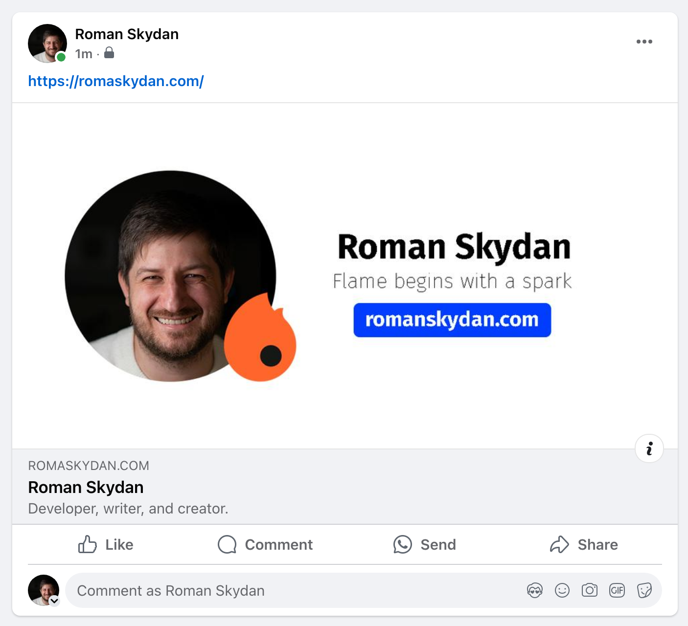

As I mentioned in my previous post, my [blog](https://romaskydan.com/) is built using Next.js. This framework is a powerful and popular tool for creating full-stack applications. It comes with many advantages but also has some drawbacks. If you search online, you'll likely find a lot of reviews on this framework. Personally, I believe that all software products have their pros and cons, and it's essential to understand that what works well for one person may not be ideal for another. Therefore, it’s crucial to know why you need a particular tool and where you plan to use it.

## Why did I choose Next.js for my blog?

There were several reasons:

- **React**. I was already familiar with React before deciding to use Next.js, so it was a logical choice. Interestingly, all the following benefits stem from this.

- **Low entry barrier**. To get started with this framework, all you need to do is read their official [documentation](https://nextjs.org/docs) and complete the [short tutorial](https://nextjs.org/learn-pages-router/basics/create-nextjs-app). If that’s not enough, there are hundreds of articles and video tutorials online to help you continue learning and answer any questions.

- **Large community**. As mentioned earlier, there’s a wealth of information available about Next.js. The framework has a large fanbase, meaning lots of tutorials, examples, and ready-made solutions that you can use in future projects.

- **Full-stack framework**. This made developing the blog simpler, as I didn’t want to complicate things by building a separate backend. With Next.js, you can write both frontend and backend code. In my case, it’s just a few endpoints for my needs, but Next.js can handle more complex applications.

- **Static generation**. The framework allows pages to be rendered at build time, improving performance and SEO. This is especially important for blogs where content updates infrequently, and pages need to load quickly. However, this feature is useful for any site that prioritizes fast loading times and good search engine indexing.

- **Easy deployment**. One of the final benefits for me was how easy it is to deploy on Vercel. It makes the process of launching your application quick and simple. However, over time, this advantage could turn into a disadvantage — as your project scales or requires specific settings, you may encounter limitations and need more complex solutions.

Naturally, Next.js has its downsides, but this post isn’t about that. Maybe I’ll write a separate post about them in the future.

## Why did I decide to write a tutorial on Next.js?

While developing my blog, I ran into many questions that I found answers to in the official documentation and other developers' posts.

That’s when I had the idea to write my own tutorial. Hopefully, it will be helpful for those just starting out with Next.js.

When choosing a project for the tutorial, I wanted to create something unique. There are already plenty of guides on how to build a blog with Next.js, so I decided that yet another blog tutorial would be redundant.

One day, while solving an issue in my blog’s code, I came up with an idea. Anyone who’s worked on creating a blog knows what [Open Graph](https://ogp.me/) is. It’s the preview that shows up when you share a link in messengers or on social media.

For example, this is how the link to my blog appears on Facebook thanks to Open Graph:



## How does Open Graph work?

Open Graph is a protocol that allows you to control how your link appears on social media. It uses special meta tags in the HTML code of the page to define the title, description, image, and other data for the preview.

```html title="index.html"
...
<meta property="og:title" content="Roman Skydan" />
<meta property="og:description" content="Developer, writer, and creator." />
<meta property="og:url" content="https://romaskydan.com" />
<meta property="og:site_name" content="Roman Skydan" />
<meta property="og:locale" content="en_US" />
<meta
  property="og:image"
  content="https://romaskydan.com/images/social-card.png" />
<meta property="og:type" content="website" />
...
```

A well-crafted link preview can attract more visitors to your site, while a poor one might turn them away. That’s why it’s essential to test and properly configure Open Graph. This is where the idea of creating a web application for testing and configuring Open Graph came from.

This tutorial will walk you through the process of building such an application. We’ll go through every step — from the idea and design to implementation. We’ll use Next.js, TypeScript, Tailwind CSS, and other technologies to build the application. We’ll host it on GitHub, deploy it on Vercel, connect a custom domain, and set up CI/CD. It will be published online, and we’ll celebrate when someone starts using it. Think of it as a reality show where you can follow along with the development process. Some decisions might change along the way, just as they do in real-world projects.

If you’re intrigued, stay tuned for the next episode of this development reality show!

## In the next ~~episode~~ article:

- We’ll dive deeper into the project idea,
- Define the key development stages for the alpha version,
- Create mockups and the design for the upcoming application.
